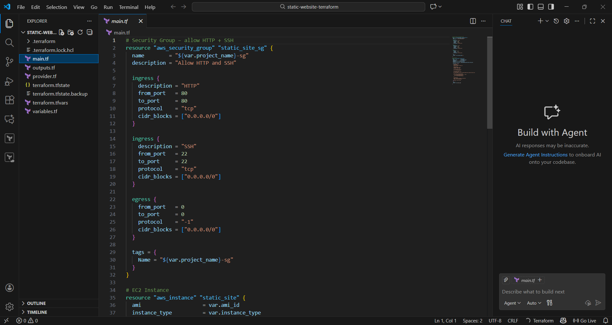
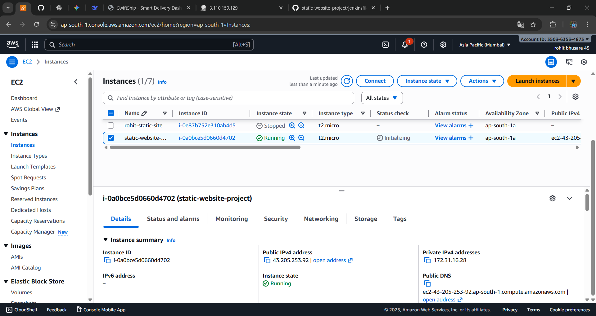
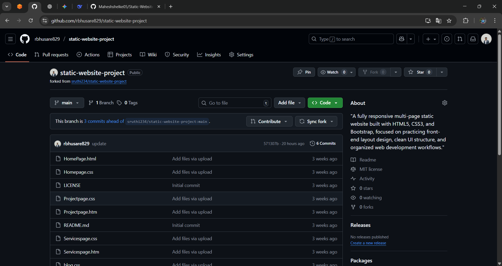
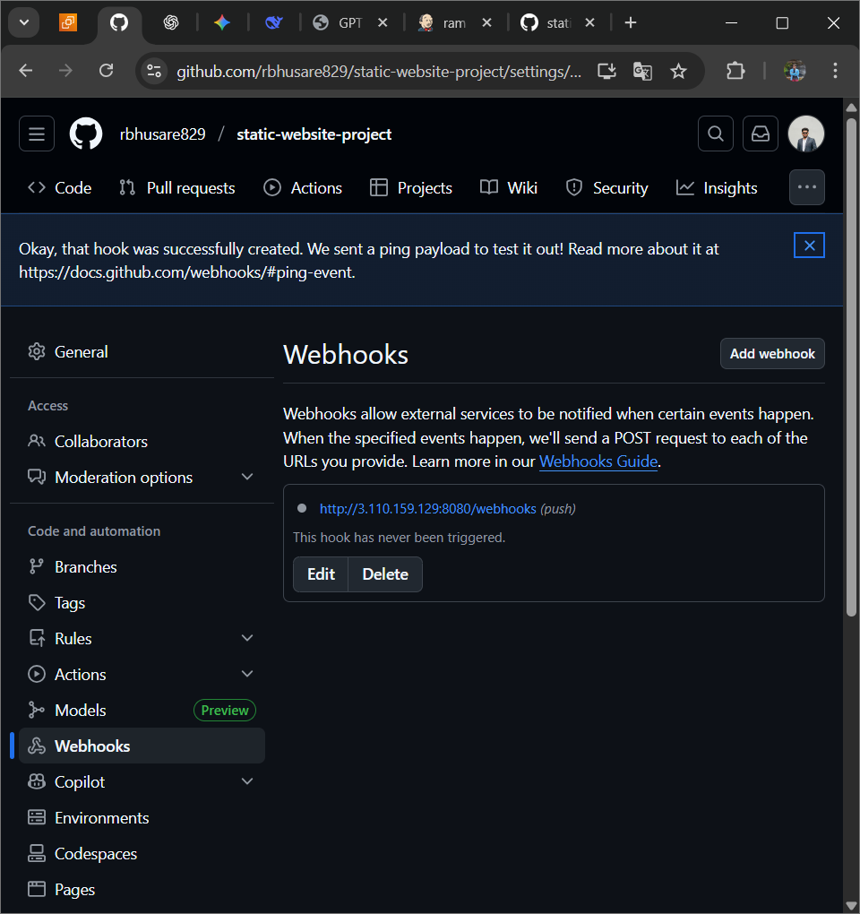
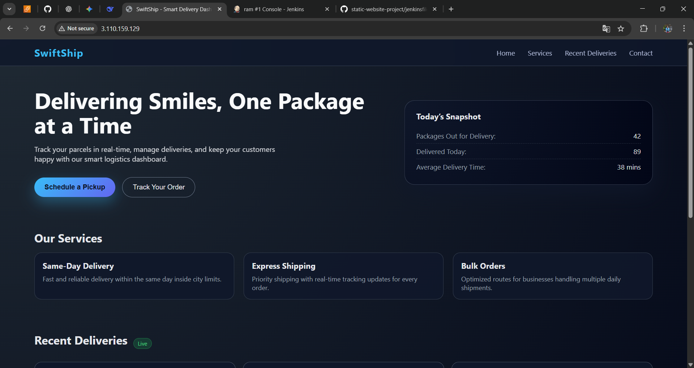

# 🚀 Static Website Deployment with CI/CD using Terraform + Jenkins + AWS

## 📌 Project Description
In this project, I deployed a static website on AWS EC2 and automated the deployment process using Jenkins, GitHub, and Terraform.  
Whenever code is pushed to GitHub → Jenkins automatically updates the website hosted on EC2.

---

## 🧰 Tools & Technologies Used
- **Terraform** → Infrastructure as Code
- **AWS EC2** → 2 Virtual Machines
  - 1️⃣ Website Server (NGINX)
  - 2️⃣ Jenkins Server (CI/CD)
- **GitHub** → Source Code hosting
- **Jenkins** → CI/CD Automation
- **Linux (Ubuntu)** → Server OS
- **NGINX** → Static Web Hosting
- **SSH** → Secure Server Access

---

## 🏗️ AWS Infrastructure Architecture
- Built using Terraform
- Automatically created:
  ✔ 2 EC2 Instances  
  ✔ Security Groups (22, 80, 8080 open)  
  ✔ SSH Key Pair  
  ✔ Automatic Software Installation via User-Data  

```
GitHub → (Webhook) → Jenkins EC2 → (SSH) → Website EC2 → NGINX → Browser
```

---

## 🪜 Step-by-Step Manual Procedure

### 1️⃣ Fork the Website Project
Repo used:
```
https://github.com/rbhusare829/static-website-project.git
```
Made UI changes and pushed to my GitHub repo.

---

### 2️⃣ Terraform Setup (Infrastructure Provisioning)

✔ Installed Terraform  
✔ Configured AWS CLI using `aws configure`

Created files:

| File | Purpose |
|------|---------|
| `main.tf` | Create EC2 + SG + Jenkins/Nginx |
| `outputs.tf` | Show URLs after creation |
| `variables.tf` | Region + Instance type inputs |
| `scripts/*.sh` | Auto-installation scripts |

✔ Applied Terraform:
```bash
terraform init
terraform apply -auto-approve
```

📌 Output:
- Website URL: `http://<public_ip>`
- Jenkins URL: `http://<public_ip>:8080`

---

### 3️⃣ NGINX Website Server Configuration
- Installed automatically with Terraform
- Website location:
```
/var/www/html
```
- NGINX restart command auto executed:
```bash
sudo systemctl restart nginx
```

---

### 4️⃣ Jenkins Server Setup
Jenkins installed automatically using Terraform.

Unlock password:
```bash
sudo cat /var/lib/jenkins/secrets/initialAdminPassword
```

✔ Suggested plugins installed  
✔ Admin user created

---

### 5️⃣ SSH Credential Add in Jenkins
```
Manage Jenkins → Manage Credentials → Add
```

| Setting | Value |
|--------|------|
| Kind | SSH Username with Private Key |
| Username | ubuntu |
| Key | `devops.pem` file content |
| ID | website-ssh |

---

### 6️⃣ Jenkins CI/CD Pipeline Configuration
Created New Pipeline Job:
```
Deploy-Static-Website
```

Used this Jenkinsfile:
```groovy
pipeline {
    agent any

    environment {
        SERVER_IP = "<JARVIS_IP>"
        SSH_KEY_ID = "website-ssh"
        WEBROOT = "/var/www/html"
        GIT_URL = "https://github.com/rbhusare829/static-website-project-2"
    }

    stages {
        stage('Checkout Code') {
            steps {
                git branch: 'main', url: "${GIT_URL}"
            }
        }

        stage('Deploy to EC2 Server') {
            steps {
                sshagent([SSH_KEY_ID]) {
                    sh """
                        ssh -o StrictHostKeyChecking=no ubuntu@${SERVER_IP} '
                            sudo systemctl stop nginx;
                            sudo rm -rf ${WEBROOT}/*;
                            sudo git clone ${GIT_URL} ${WEBROOT};
                            sudo systemctl start nginx;
                        '
                    """
                }
            }
        }
    }

    post {
        success {
            echo "Deployment Successful!"
        }
        failure {
            echo "Deployment Failed!"
        }
    }
}
```

---

### 7️⃣ GitHub Webhook Setup
GitHub → Repo → Settings → Webhooks → Add Webhook

| Field | Value |
|------|------|
| Payload URL | `http://<jenkins-ip>:8080/github-webhook/` |
| Content Type | `application/json` |
| Event | Just the push event |

---

## ✔ Final Result

| Action | Output |
|--------|--------|
| Code pushed to GitHub | Jenkins auto triggered |
| Jenkins deployment pipeline | Success ✔ |
| Website auto-updated | Yes ✔ |
| CI/CD Fully automated | Done 🏆 |

🎉 **Project Completed Successfully**

---

## 📘 What I Learned
- Terraform advanced EC2 setup
- Jenkins CI/CD automation with SSH
- Webhook integration for real-time deployments
- Linux & NGINX configuration for hosting

---

---

## Screenshots

### Terraform & AWS Infrastructure
| Screenshot                          | Description                                      |
|-------------------------------------|--------------------------------------------------|
|          | **Terraform Code** – main.tf, variables, outputs & scripts |
|             | **AWS Console** – 2 EC2s (Jenkins + Website) running     |

### GitHub Repository
| Screenshot                          | Description                                      |
|-------------------------------------|--------------------------------------------------|
|                 | **GitHub Repository** – Website code + Jenkinsfile      |

### Jenkins CI/CD Pipeline
| Screenshot                              | Description                                          |
|-----------------------------------------|------------------------------------------------------|
|                     | **Jenkinsfile** – Pipeline as Code                           |
|           | **Pipeline Job** – Successful build history                  |
|     | **SSH Credentials** – Added ubuntu private key               |
| 
|                     | **SSH Agent Step** – Deploying via sshagent                  |

### GitHub Webhook
| Screenshot                          | Description                                      |
|-------------------------------------|--------------------------------------------------|
|                             | **GitHub Webhook** – Auto-triggers Jenkins on push      |

### Final Result – Live Website
| Screenshot                          | Description                                      |
|-------------------------------------|--------------------------------------------------|
|                   | **Live Static Website** – Successfully deployed & updated   |

---

**Fully Automated Zero-Touch Deployment Achieved**

Made with love by **ROHIT BHUSARE**  
DevOps Engineer | Cloud | Automation
---
## 👨‍💻 Author
**ROHIT BHUSARE**  
DevOps Engineer 🚀

